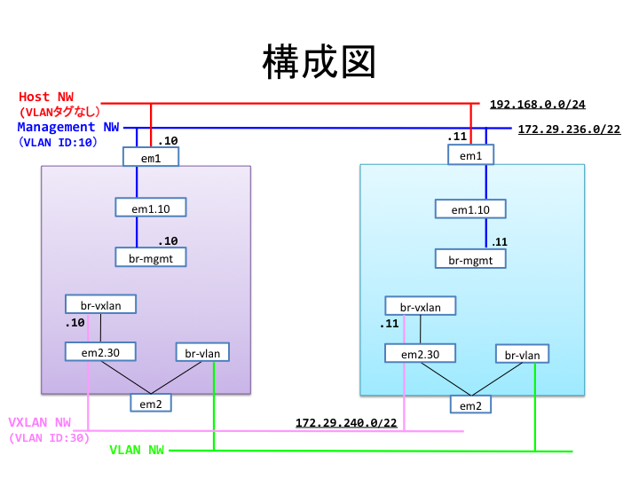

title: OpenStack-Ansibleで作るOpenStack HA環境 Kilo版
Company: 日本仮想化技術
Version:1.0.0

#OpenStack-Ansibleで作るOpenStack HA環境 Kilo版

<div class="title">
バージョン：1.0.0-1 (2016/04/05/作成)<br>
日本仮想化技術株式会社
</div>

<!-- BREAK -->

##変更履歴

|バージョン|更新日|更新内容|
|:---|:---|:---|
|0.9.0|2016/01/18|Kilo版執筆開始|
|0.9.1|2016/02/03|文言の修正|
|0.9.2|2016/02/10|Tipsとトラブルシューティングの追加 他|
|1.0.0|2016/03/04|「YAMLファイルの構文について」を追加、誤記の修正 他|
|1.0.0-1|2016/04/05|3.2 位置のズレを修正、7.4 誤記の修正|


````
筆者注:このドキュメントに対する提案や誤りの指摘は
Issue登録か、日本仮想化技術までメールにてお願いします。
https://github.com/virtualtech/openstack-ansible-docs/issues
````


<!-- BREAK -->

## 目次
<!--TOC max3-->
<!-- BREAK -->

<!--
#Part.1 OpenStack 構築編
-->

## はじめに
OpenStack-Ansibleは、Ansibleを使用してOpenStackの構築・機能追加・アップグレードを容易にデプロイできることをめざすOpenStack Foundation公式のプロジェクトです。

OpenStack-Ansible<br><https://github.com/openstack/openstack-ansible>

本書では、2台のサーバーを使ってOpenStack-Ansibleに必要な環境を準備し、実際にOpenStackをデプロイする手順を解説します。

#### 参考文献

***OpenStack-Ansible Installation Guide***<br>
<http://docs.openstack.org/developer/openstack-ansible/install-guide/index.html>
<br><br>
Kevin Jackson; Cody Bunch; Egle Sigler 著 ***OpenStack Cloud Computing Cookbook Third Edition***<br>
Packt Publishing Limited.


<!-- BREAK -->


## 1. 構築する環境について

### 1.1 サーバーの構成

#### 物理サーバー

本書はOpenStack環境をControllerサーバー1台、Computeサーバー1台の計2台を物理サーバー上に構築することを想定しています。最低限必要となるスペックは以下のとおりです。


| |Controllerサーバー|Computeサーバー|
|:--|:-:|:-:|
|CPU| 8コア以上| 2コア |
|メモリ|16GB以上|8GB以上|
|ディスク1|80GB|40GB|
|ディスク2|任意のサイズ|（不要）|
|NIC|2つ以上|2つ以上|


#### LXCコンテナの構成

OpenStack-Ansibleではコンポーネント毎にLXCコンテナが作成され、そこへ各コンポーネントをインストールされます。

重要なコンポーネントについては可用性を高めるために複数のコンテナを立てクラスタを構成します。クラスタのノード数は、データの書き込みが行われるコンポーネントは奇数台（3台以上）が望ましい構成となります。これは、障害によりデータ競合が発生した場合多数決で処理されるためです。

今回は検証環境の構築を想定しているため1台の物理サーバーの中で組まれていますが、本番運用で構築する場合はControllerサーバーを3台以上用意することを推奨します。

Controllerサーバーに作成されるLXCコンテナは以下のとおりです。

| コンテナ名 | 分類 | 用途 |
|:--------------|:-------------|:--------------|
| galera_container-01 | Infrastructure | Galeraクラスタ（DBサービス） |
| galera_container-02 | Infrastructure | Galeraクラスタ（DBサービス） |
| galera_container-03 | Infrastructure | Galeraクラスタ（DBサービス） |
| rabbit_mq_container-01 | Infrastructure | RabbitMQ（メッセージキューサービス） |
| rabbit_mq_container-02 | Infrastructure | RabbitMQ（メッセージキューサービス） |
| rabbit_mq_container-03 | Infrastructure | RabbitMQ（メッセージキューサービス） |
| memcached_container | Infrastructure | memcacheed |
| repo_container-01 | Infrastructure | コンテナ向けローカルリポジトリ |
| repo_container-02 | Infrastructure | コンテナ向けローカルリポジトリ |
| rsyslog_container | Infrastructure | Syslogサービス |
| utility_container | Infrastructure | OpenStack CUIクライアントツール |
| keystone_container-01 | OpenStack | Keystoneサービス |
| keystone_container-02 | OpenStack | Keystoneサービス |
| glance_container | OpenStack | Glanceサービス |
| cinder_api_container | OpenStack | Cinder APIサービス |
| cinder_scheduler_container | OpenStack | Cinderスケジューラー |
| nova_api_metadata_container | OpenStack | Nova Metadata APIサービス |
| nova_api_os_compute_container | OpenStack | Nova Compute APIサービス |
| nova_cert_container | OpenStack | Nova Certサービス（証明書管理） |
| nova_conductor_container | OpenStack | Nova Conductorサービス |
| nova_console_container | OpenStack | Nova Consoleサービス |
| nova_scheduler_container | OpenStack | Nova Schedulerサービス |
| neutron_agents_container | OpenStack | Neutron agentサービス |
| neutron_server_container | OpenStack | Neutron server(API)サービス |
| heat_apis_container | OpenStack | Heat APIサービス |
| heat_engine_container | OpenStack | Heat Engineサービス |
| horizon_container-01 | OpenStack | Horizon(Dashboard)サービス |
| horizon_container-02 | OpenStack | Horizon(Dashboard)サービス |

<!-- BREAK -->

### 1.2 環境構築に使用するOS

OSはUbuntu Server を使用します。Ubuntu Serverでは新しいハードウェアのサポートを積極的に行うディストリビューションです。そのため、Linux KernelのバージョンをTrustyの場合は14.04.2以降のLTSのポイントリリースごとに、スタンダート版のUbuntuと同様のバージョンに置き換えてリリースしています。


- <https://wiki.ubuntu.com/Kernel/LTSEnablementStack>

一般的な利用では特に問題ありませんが、OpenStackとSDNのソリューションを連携した環境を作る場合などに、Linux KernelやOSのバージョンを考慮しなくてはならない場合があります。
また、Trustyの場合はLinux Kernel v3.13以外のバージョンのサポート期間はTrustyのサポート期間と同様ではありません。期限が切れた後はLinux Kernel v3.13にダウングレードするか、新しいLinux Kernelをインストールすることができるメタパッケージを手動で導入する必要がありますので注意してください。

本書ではサポート期間が長く、Trustyの初期リリースの標準カーネルであるLinux Kernel v3.13を使うために、以下のURLよりイメージをダウンロードしたUbuntu Server 14.04.1 LTS(以下Ubuntu Server)のイメージを使ってインストールします。インストール後`apt-get dist-upgrade`を行って最新のアップデートを適用した状態にしてください。Trustyではこのコマンドを実行してもカーネルのバージョンがアップグレードされることはありません。

本書は3.13.0-68以降のバージョンのカーネルで動作するUbuntu 14.04.1を想定しています。

- <http://old-releases.ubuntu.com/releases/14.04.1/ubuntu-14.04.1-server-amd64.iso>

<!-- BREAK -->

### 1.3 ネットワーク設計

今回の例では以下に述べるネットワーク構成で構築する前提で解説します。



#### 物理構成

双方のサーバーのem1には管理用、em2にはサービス用のトラフィックが流れるように構築します。それぞれのインターフェースはVLANを使用して複数のセグメントを扱うため、スイッチを経由する場合は**タグVLANを有効（Trunkモード）**にする必要があります。

#### ホスト管理用ネットワーク

管理用イントラネットワークに接続するネットワークセグメントで、OSインストール時に設定します。apt-get等を実行するときこのネットワークを経由するためインターネットへアクセスできる環境である必要があります。今回は物理インターフェースem1へ割り当てます。

- 物理インターフェース：em1
- VLAN：Untagged/Native
- ブリッジインターフェース：なし
- ネットワークセグメント：192.168.0.0/24
- ゲートウェイ：192.168.0.1
- DNSサーバー：8.8.8.8

#### コンテナ管理用ネットワーク

OpenStack-Ansible環境の各コンテナ間で使用する独立したネットワークセグメントです。各サービス間のAPI連携はこのネットワークを使用して通信されます。今回はタグVLANを使用して物理インターフェースem1へ割り当てます。

- 物理インターフェース：em1
- VLAN ID：10
- ブリッジインターフェース：br-mgmt
- ネットワークセグメント：172.29.236.0/22

#### プロジェクト（テナント）用VLANネットワーク

OpenStack構築後、各プロジェクト（テナント）のサービス用に割り当てるネットワークとして使用します。このネットワークではタグVLANを使用して複数のセグメントを割り当てられるようにします。インターネットへ接続する必要がある場合は別途接続先のスイッチ等でVLANの設定を行ってください。今回は物理インターフェースem2を使用します。

- 物理インターフェース：em2
- VLAN ID：任意（OpenStack構築後ネットワーク作成時に指定）
- ブリッジインターフェース：br-vlan


#### プロジェクト（テナント）用VXLANネットワーク

OpenStack構築後、各プロジェクト（テナント）の内部用に割り当てるネットワークとして使用します。このネットワークではVXLANを使用してプロジェクト内で作成されたネットワークをトンネル化します。今回はタグVLANを使用して物理インターフェースem2へ割り当てます。

- 物理インターフェース：em2
- VLAN ID：30
- ブリッジインターフェース：br-vxlan
- ネットワークセグメント：172.29.240.0/22

### 1.4 各サーバーのネットワーク設定

各サーバーの設定するアドレスは以下の通りです。

#### Controllerサーバー

|インターフェース|em1|em1.10|em2|em2.30|
|:-:|:-:|:-:|:-:|:-:|
|IPアドレス|192.168.0.10|172.29.236.10|（なし）|172.29.240.10|
|ネットマスク|255.255.255.0|255.255.252.0|（なし）|255.255.252.0|
|ゲートウェイ|192.168.0.1| - | - | - |
|ネームサーバー|8.8.8.8| - | - | - |

#### Computeサーバー

|インターフェース|em1|em1.10|em2|em2.30|
|:-:|:-:|:-:|:-:|:-:|
|IPアドレス|192.168.0.11|172.29.236.11|（なし）|172.29.240.11|
|ネットマスク|255.255.255.0|255.255.252.0|（なし）|255.255.252.0|
|ゲートウェイ|192.168.0.1| - | - | - |
|ネームサーバー|8.8.8.8| - | - | - |

<!-- BREAK -->

### 1.5 Ubuntu Serverのインストールと初期設定

#### Ubuntu Serverのインストール

2台のサーバーに対し、Ubuntu Serverをインストールします。要点は以下の通りです。

+ 優先ネットワークインターフェースをem1に指定  
+ インターネットへ接続するインターフェースはem1を使用するため、インストール中はem1を優先ネットワークとして指定します。
+ OSは最小インストール
+ パッケージ選択ではOpenSSH serverのみ選択

<!-- BREAK -->

#### インストール時の設定パラメータ例

|設定項目|設定例|
|:---|:---|
|初期起動時のLanguage|English|
|起動|Install Ubuntu Server|
|言語|English - English|
|地域の設定|other→Asia→Japan|
|地域の言語|United States - en_US.UTF-8|
|キーボードレイアウトの認識|No|
|キーボードの言語|Japanese→Japanese|
|優先するNIC|em1: Ethernet|
|ホスト名|それぞれのサーバー名(controller, compute)|
|ユーザ名とパスワード|フルネームで入力|
|アカウント名|ユーザ名のファーストネームで設定される|
|パスワード|任意のパスワード|
|Weak password（出ない場合も）|Yesを選択|
|ホームの暗号化|任意|
|タイムゾーン|Asia/Tokyoであることを確認|
|パーティション設定|Guided - use entire disk and set up LVM|
|パーティション選択|sdaを選択|
|パーティション書き込み|Yesを選択|
|パーティションサイズ|デフォルトのまま|
|変更の書き込み|Yesを選択|
|HTTP proxy|環境に合わせて任意|
|アップグレード|No automatic updatesを推奨|
|ソフトウェア|OpenSSH serverのみ選択|
|GRUB|Yesを選択|
|インストール完了|Continueを選択|

```
筆者注:
Ubuntuインストール時に選択した言語がインストール後も使われます。
Ubuntu Serverで日本語の言語を設定した場合、標準出力や標準エラー出力が文字化けしたり、作成されるキーペア名が文字化けするなど様々な問題が起きますので、言語は英語を設定されることを推奨します。
```

<!-- BREAK -->

#### プロキシーの設定

外部ネットワークとの接続にプロキシーの設定が必要な場合は、aptコマンドを使ってパッケージの照会やダウンロードを行うために次のような設定をする必要があります。

- システムのプロキシー設定

```
# vi /etc/environment
http_proxy="http://proxy.example.com:8080/"
https_proxy="https://proxy.example.com:8080/"
```

- APTのプロキシー設定

```
# vi /etc/apt/apt.conf
Acquire::http::proxy "http://proxy.example.com:8080/";
Acquire::https::proxy "https://proxy.example.com:8080/";
```

より詳細な情報は下記のサイトの情報を確認ください。

- <https://help.ubuntu.com/community/AptGet/Howto>

### 1.6 Ubuntu Serverへのログインとroot権限

Ubuntuはデフォルト設定でrootユーザーの利用を許可していないため、root権限が必要となる作業は以下のように行ってください。

+ rootユーザーで直接ログインできないので、インストール時に作成したアカウントでログインする。
+ root権限が必要な場合には、sudoコマンドを使用する。
+ rootで連続して作業したい場合には、sudo -iコマンドでシェルを起動する。

<!-- BREAK -->


## 2. OpenStack-Ansibleインストール前の設定

本章では、OpenStackパッケージのインストール前に各々のサーバーで以下の設定を行います。

+ パッケージ インストール
+ カーネルのアップグレード
+ ネットワークデバイスの設定
+ 物理ボリュームの設定

### 2.1 パッケージインストール


OpenStack-Ansible環境を構築するにあたり、必要となるパッケージのインストールを行います。

#### Controllerサーバー

```
controller$ sudo -i
controller# apt-get update
controoler$ apt-get install aptitude build-essential git python-dev bridge-utils debootstrap ifenslave ifenslave-2.6 lsof lvm2 ntp ntpdate openssh-server sudo tcpdump vlan python-crypto python-yaml
```

#### Computeサーバー

```
compute$ sudo -i
compute# apt-get update
compute# apt-get install bridge-utils debootstrap ifenslave ifenslave-2.6 lsof lvm2 ntp ntpdate openssh-server sudo tcpdump vlan
```

#### タグVLANの有効化

VLAN有効化するには、vlanパッケージインストール後モジュールの有効化をする必要があります。
双方のサーバーでタグVLANを有効化します。

```
# echo '8021q' >> /etc/modules
```

<!-- BREAK -->

### 2.2 カーネルのアップグレード

OpenStack-AnsibleではLinuxカーネルのバージョンが 3.13.0-34 以上の環境を要求します。ControllerサーバーとComputeサーバーの両方でカーネルのアップグレード行います。

```
# apt-get dist-upgrade
```

### 2.3 ネットワークデバイスの設定

ControllerサーバーとComputeサーバーのネットワークを設定します。

#### ControllerサーバーのIPアドレスの設定

```
controller:$ vi /etc/network/interfaces

auto em1
iface em1 inet static
  address 192.168.0.10
  netmask 255.255.255.0
  gateway 192.168.0.1
  dns-nameservers 8.8.8.8

iface em1.10 inet manual
  vlan-raw-device em1

auto em2
iface em2 inet manual

iface em2.30 inet manual
  vlan-raw-device em2

auto br-mgmt
iface br-mgmt inet static
  bridge_stp off
  bridge_waitport 0
  bridge_fd 0
  bridge_ports em1.10
  address 172.29.236.10
  netmask 255.255.252.0

auto br-vlan
iface br-vlan inet manual
  bridge_stp off
  bridge_waitport 0
  bridge_fd 0
  bridge_ports em2

auto br-vxlan
iface br-vxlan inet static
  bridge_stp off
  bridge_waitport 0
  bridge_fd 0
  bridge_ports em2.30
  address 172.29.240.10
  netmask 255.255.252.0
```

#### ComputeサーバーのIPアドレスの設定

```
ubuntu@compute:~$ vi /etc/network/interfaces

auto em1
iface em1 inet static
  address 192.168.0.11
  netmask 255.255.255.0
  gateway 192.168.0.1
  dns-nameservers 8.8.8.8

iface em1.10 inet manual
  vlan-raw-device em1

auto em2
iface em2 inet manual

iface em2.30 inet manual
  vlan-raw-device em2

auto br-mgmt
iface br-mgmt inet static
  bridge_stp off
  bridge_waitport 0
  bridge_fd 0
  bridge_ports em1.10
  address 172.29.236.11
  netmask 255.255.252.0

auto br-vlan
iface br-vlan inet manual
  bridge_stp off
  bridge_waitport 0
  bridge_fd 0
  bridge_ports em2

auto br-vxlan
iface br-vxlan inet static
  bridge_stp off
  bridge_waitport 0
  bridge_fd 0
  bridge_ports em2.30
  address 172.29.240.11
  netmask 255.255.252.0
```

#### ホストの再起動

設定後、ControllerサーバーとComputeサーバーを再起動します。

```
# shutdown -r now
```

<!-- BREAK -->

### 2.4 物理ボリュームの設定

ControllerサーバーにCinder用のLVMボリュームグループを作成します。

まず、デバイス /dev/sdb に対しLVM物理ボリュームを作成します。

```
controller$ sudo pvcreate /dev/sdb
```

LVM物理ボリュームが作成されたことを確認します。

```
controller$ sudo pvscan
  PV /dev/sdb                      lvm2 [279.37 GiB]
  Total: 1 [279.37 GiB] / in use: 0 [0   ] / in no VG: 1 [279.37 GiB]
```

続いて、LVMボリュームグループを作成し先ほど作成した物理ボリュームを登録します。

```
controller$ sudo vgcreate cinder-volumes /dev/sdb
```

ボリュームグループが作成されたか確認します。

```
controller$ sudo vgscan
  Reading all physical volumes.  This may take a while...
  Found volume group "cinder-volumes" using metadata type lvm2
```


<!-- BREAK -->


## 3. OpenStack-Ansibleの設定

本章では、OpenStack-AnsibleをGitHubからダウンロードし、設定ファイル（YAML形式）を編集します。

設定に用いる対象ファイルは以下の3ファイルです。

+ openstack_user_config.yml
+ user_variables.yml
+ user_sercret.yml


### 3.1 OpenStack-Ansibleのダウンロード

GitHubからOpenStack-Ansibleをダウンロードし、 /opt/openstack-ansible ディレクトリへ格納します。

#### ダウンロード

```
controller$ sudo git clone https://github.com/openstack/openstack-ansible /opt/openstack-ansible
```

#### バージョンの指定

使用するOpenStack-Ansibleのバージョンのタグをチェックアウトします。
（今回は11.2.6を指定します。）

```
controller$ cd /opt/openstack-ansible/
controller$ git tag -l
controller$ sudo git checkout 11.2.6
```

チェックアウトが正しく行われたか確認します。

```
controller$ git branch -a
```
(detached from 11.2.6)と表示されていることを確認します。

#### 設定ファイルのコピー

設定ファイルを /etc/openstack_deploy へコピーします。

```
controller$ sudo cp -a /opt/openstack-ansible/etc/openstack_deploy /etc/openstack_deploy
```

### 3.2 openstack_user_config.ymlファイルの作成

openstack_user_config.yml ファイルを作成し、以下の設定を記述していきます。

```
controller$ sudo vi /etc/openstack_deploy/openstack_user_config.yml
```

#### cidr_networks セクション

OpenStack-Ansibleで使用するネットワークを定義します。
今回の環境では以下2つのネットワークを設定します。

- management : コンテナ用ネットワーク
- tunnel : プロジェクト（テナント）用ネットワーク

```
---       ← ファイルの先頭行にYAMLのセパレーション記号「---」を記述
cidr_networks:
  management: 172.29.236.0/22
  tunnel: 172.29.240.0/22
```

#### used_ipsセクション

OpenStack-Ansibleでは、LXCコンテナで使用するIPアドレスを定義したアドレス範囲内で自動生成します。
すでに使用しているアドレスや使用されたくないアドレスがある場合は、user_ipsセクションで予約します。

アドレスの指定は単一もしくは範囲で指定します。範囲で使用する場合はカンマ区切りで下限と上限のIPアドレスを指定します。

```
used_ips:
  - 172.29.236.1,172.29.236.31
  - 172.29.240.1,172.29.240.31
```

#### global_overridesセクション

OpenStack-AnsibleではHAProxyを使用してクラスタ構成しているサービスのロードバランシングを行います。設定内容は以下のとおりです。

|項目|内容|
|:--|:--|
|internal_bl_vip_address|内部向けアドレス。コンテナ管理用ネットワークセグメント内のアドレスを指定|
|external_bl_vip_address|外部向けアドレス。ホスト管理用ネットワークセグメント内のアドレスを指定|
|lb_name|ロードバランサーの名前|
|tunnel_bridge|VXLANで使用するブリッジを指定|
|management_bridge|管理用ネットワーク使用するブリッジを指定|
|probider_networks|各ネットワークの詳細を設定|

```
global_overrides:
  internal_lb_vip_address: 172.29.236.10
  external_lb_vip_address: 192.168.0.10
  lb_name: haproxy
  tunnel_bridge: "br-vxlan"
  management_bridge: "br-mgmt"
  provider_networks:
    - network:
        group_binds:
          - all_containers
          - hosts
        type: "raw"
        container_bridge: "br-mgmt"
        container_interface: "eth1"
        container_type: "veth"
        ip_from_q: "management"
        is_container_address: true
        is_ssh_address: true
    - network:
        group_binds:
          - neutron_linuxbridge_agent
        container_bridge: "br-vxlan"
        container_type: "veth"
        container_interface: "eth10"
        ip_from_q: "tunnel"
        type: "vxlan"
        range: "1:1000"
        net_name: "vxlan"
    - network:
        group_binds:
          - neutron_linuxbridge_agent
        container_bridge: "br-vlan"
        container_type: "veth"
        container_interface: "eth11"
        type: "vlan"
        range: "1:1"
        net_name: "vlan"
    - network:
        group_binds:
          - neutron_linuxbridge_agent
        container_bridge: "br-vlan"
        container_type: "veth"
        container_interface: "eth12"
        host_bind_override: "em2"
        type: "flat"
        net_name: "flat"
```

#### shared-infra_hostsセクション

OpenStackの各コンポーネントと連携するサービス（GaleraDBクラスタ、RabbitMQ、Memcached等）を稼働させるホストを指定します。

今回はコントローラサーバー（controller）上にGaleraDBクラスタ用のコンテナを3台、RabbitMQ用のコンテナを3台、Memcached用のコンテナを1台インストールする設定とします。

```
shared-infra_hosts:
  controller-01:
    affinity:
      galera_container: 3
      rabbit_mq_container: 3
    ip: 172.29.236.10
```

なお、物理マシンを複数台用意する場合は以下のように指定します。

```
shared-infra_hosts:
  infra-01:
    ip: 172.29.236.21
  infra-02:
    ip: 172.29.236.22
  infra-03:
    ip: 172.29.236.23
```

#### os-infra_hostsセクション

OpenStackの各コンポーネントを稼働させるホストを指定します。
今回はコントローラサーバー（controller）上にGlance API用のコンテナを1台、Nova API用のコンテナを1台、Horizon用のコンテナを2台インストールする設定とします。

```
os-infra_hosts:
  controller-01:
    affinity:
      horizon_container: 2
    ip: 172.29.236.10
```

#### storage-infra_hostセクション

Cinder APIを稼働させるホストを指定します。
今回はコントローラサーバー（controller）上にCinder API用のコンテナを1台インストールする設定とします。

```
storage-infra_hosts:
  controller-01:
    ip: 172.29.236.10
```

#### identity_hostsセクション

Keystoneを稼働させるホストを指定します。
今回はコントローラサーバー（controller）上にKeystone API用のコンテナを2台インストールする設定とします。

```
identity_hosts:
  controller-01:
    affinity:
      keystone_container: 2
    ip: 172.29.236.10
```


#### compute_hostsセクション

Nova computeを稼働させるホストを指定します。
今回はコンピュートサーバー（compute）にNova computeサービスをデプロイする設定とします。

```
compute_hosts:
  compute-01:
    ip: 172.29.236.11
```

#### storage_hostsセクション

Cinderストレージサーバーを稼働させるホストを指定とします。
今回はコントローラーサーバーにCinder volumeサービスをデプロイし、ボリュームをLVMボリュームグループ上に作成します。

```
storage_hosts:
  controller-01:
    ip: 172.29.236.10
    container_vars:
      cinder_backends:
        limit_container_types: cinder_volume
        lvm:
          volume_backend_name: LVM_iSCSI
          volume_driver: cinder.volume.drivers.lvm.LVMVolumeDriver
          volume_group: cinder-volumes
```


#### network_hostsセクション

Neutron APIサービスを稼働させるホストを指定します。
今回はControllerサーバーにNeutronサービスをデプロイする設定とします。

```
network_hosts:
  controller-01:
    ip: 172.29.236.10
```

#### repo-infra_hostsセクション

パッケージレポジトリを稼働させるホストを指定します。
今回はControllerサーバーにパッケージレポジトリ用のコンテナを2台インストールする設定とします。

```
repo-infra_hosts:
  controller-01:
    affinity:
      repo_container: 2
    ip: 172.29.236.10
```

#### haproxy_hostsセクション

HAProxyを稼働させるホストを指定します。
今回はControllerサーバーにHAProxyをインストールする設定とします。

```
haproxy_hosts:
  controller-01:
    ip: 172.29.236.10
```

### 3.3 user_variables.ymlファイルの設定

本ファイルにおいてはOpenStackコンポーネント（Glance、Nova、Apache等）のオプション設定を行います。
以下のコマンドで設定ファイルを編集します。

```
controller$ sudo vi /etc/openstack_deploy/user_variables.yml

## Glance Options
# Set glance_default_store to "swift" if using Cloud Files or swift backend
# or "rbd" if using ceph backend; the latter will trigger ceph to get
# installed on glance
glance_default_store: file        ← コメントが外れていることを確認
（省略）
# This defaults to KVM, if you are deploying on a host that is not KVM capable
# change this to your hypervisor type: IE "qemu", "lxc".
nova_virt_type: kvm               ← コメントを外す
nova_cpu_allocation_ratio: 2.0    ← コメントを外す
nova_ram_allocation_ratio: 1.0    ← コメントを外す
```

### 3.4 user_secrets.ymlファイルの設定

user_secrets.yml ファイルでは、OpenStack内の各コンポーネントで使用する初期パスワードをまとめています。
以下の操作を行い、user_secrets.yml ファイルにパスワードを生成します。

```
controller$ cd /opt/openstack-ansible/
controller$ sudo scripts/pw-token-gen.py --file /etc/openstack_deploy/user_secrets.yml
```

生成したパスワードを確認します。

```
controller$ sudo less /etc/openstack_deploy/user_secrets.yml
```

上記ファイルのなかの keystone_auth_admin_password が horizon へログインするためのパスワードとなります。
パスワードを変更したい場合は、以下のように任意の文字へ変更します。

例)：

```
controller$ sudo vi /etc/openstack_deploy/user_secrets.yml

（省略）
keystone_auth_admin_password: password     # 任意のパスワードに変更
```


<!-- BREAK -->


## 4. OpenStackのデプロイ

本章では、前章で設定したYAMLファイルを元にAnsibleを利用してOpenStackをデプロイします。
実行するスクリプトやAnsible Playbookは /opt/openstack-ansible/ ディレクトリに格納されており、
次項の手順に従いOpenStackをインストールします。

### 4.1 OpenStack-Ansibleの事前準備

以下のスクリプトを実行し、OpenStack-Ansibleの事前準備を行います。
スクリプトでは必要なパッケージのインストールや設定等が実行されます。

```
controller$ cd /opt/openstack-ansible/
controller$ sudo scripts/bootstrap-ansible.sh
```

Ansibleは公開鍵認証を使ってログインできることが前提条件となるため、以下の手順でComputeサーバーへSSH公開鍵を登録します。

ControllerサーバーでrootアカウントのSSH公開鍵を確認します。

```
controller$ sudo -i
controller# cat /root/.ssh/id_rsa.pub
```

上記コマンドで表示された結果を控えておき、Computeサーバーの authorized_keys ファイルへ公開鍵を貼り付けます。

```
compute$ sudo -i
compute# mkdir /root/.ssh
compute# vi /root/.ssh/authorized_keys
```

controllerサーバーから、SSHでrootログインできることを確認します。

```
controller# ssh localhost
The authenticity of host 'localhost (::1)' can't be established.
ECDSA key fingerprint is 29:48:13:48:22:69:68:34:e9:19:ae:1e:39:58:83:ac.
Are you sure you want to continue connecting (yes/no)? yes

controller# exit

controller# ssh 172.29.236.11
The authenticity of host 'localhost (::1)' can't be established.
ECDSA key fingerprint is 29:48:13:48:22:69:68:34:e9:19:ae:1e:39:58:83:ac.
Are you sure you want to continue connecting (yes/no)? yes
Warning: Permanently added '172.29.236.11' (ECDSA) to the list of known hosts.
Welcome to Ubuntu 14.04.3 LTS (GNU/Linux 3.13.0-76-generic x86_64)

controller# exit
```

### 4.2 setup-hosts.ymlの実行

前項でスクリプトを実行すると、Playbookを実行するために使用する openstack-ansible と呼ばれるラッパースクリプトがインストールされます。
そのスクリプトを用いて setup-hosts.yml を実行し、各種LXCコンテナの作成とComputeサーバーの事前準備を行います。

```
controller$ cd /opt/openstack-ansible/playbooks/
controller$ sudo openstack-ansible setup-hosts.yml -vvv
```

実行結果がすべてOKと出力されれば問題ありません。Playbookが異常終了した場合は、原因を対処し以下のコマンドでPlaybookを再開してください。

```
controller$ sudo openstack-ansible setup-hosts.yml --limit @/home/ubuntu/setup-hosts.retry
```

### 4.3 haproxy-install.ymlの実行

haproxy-install.yml を実行し、HAProxyのインストールを行います。

```
controller$ sudo openstack-ansible haproxy-install.yml -vvv
```

実行結果がすべてOKと出力されれば問題ありません。Playbookが異常終了した場合は、原因を対処し以下のコマンドでPlaybookを再開してください。

```
controller$ openstack-ansible haproxy-install.yml --limit @/home/ubuntu/haproxy-install.retry
```

<!-- BREAK -->

### 4.4 setup-infrastructure.ymlの実行

setup-infrastructure.yml を実行しインフラ環境をセットアップします。Playbookを実行すると以下の環境が構築されます。

- MariaDB Galera Cluster
- RabbitMQ
- memcached
- syslogd

```
controller$ sudo openstack-ansible setup-infrastructure.yml -vvv
```

実行結果がすべてOKと出力されれば問題ありません。Playbookが異常終了した場合は、原因を対処し以下のコマンドでPlaybookを再開してください。

```
controller$ sudo openstack-ansible setup-infrastructure.yml --limit @/home/ubuntu/setup-infrastructure.retry
```

### 4.5 setup-openstack.ymlの実行

setup-openstack.yml を実行し、以下のOpenStackコンポーネントをセットアップします。

- Keystone
- Galnce
- Cinder
- Nova
- Neutron
- Horizon

```
controller$ sudo openstack-ansible setup-openstack.yml -vvv
```

実行結果がすべてOKと出力されれば問題ありません。Playbookが異常終了した場合は、原因を対処し以下のコマンドでPlaybookを再開してください。
```
controller$ sudo openstack-ansible setup-openstack.yml --limit @/home/ubuntu/setup-openstack.retry
```

<!-- BREAK -->


## 5. コンテナの操作

OpneStack-Ansibleで構築されたコンテナは、LXCの各コマンドを使って操作します。
なお、コンテナの操作はrootユーザーで実行します。あらかじめsudoコマンドでrootユーザーに切り替えてください。

```
controller$ sudo -i
```

#### コンテナ操作コマンド一覧

|内容|コマンド|
|:--|:--|
|コンテナの一覧表示|lxc-ls --fansy|
|コンテナの詳細表示|lxc-info --name <コンテナ名>|
|コンテナの起動|lxc-start --daemon --name <コンテナ名>|
|コンテナの停止|lxc-stop --name <コンテナ名>|
|コンテナ内へログイン|lxc-attach --name <コンテナ名>|

#### コンテナ操作の出力例

ここでは、コンテナの一覧表示と、コンテナ内へのログイン方法の例を紹介します。

- コンテナの一覧表示

```
root@controller:~# lxc-ls --fancy
NAME                                                  STATE    IPV4                                        IPV6  AUTOSTART
----------------------------------------------------------------------------------------------------------------------------------------
controller-01_cinder_api_container-3157cd2c           RUNNING  10.0.3.156, 172.29.236.56                   -     YES (onboot, openstack)
controller-01_cinder_scheduler_container-b6a20022     RUNNING  10.0.3.85, 172.29.236.243                   -     YES (onboot, openstack)
controller-01_galera_container-29d52973               RUNNING  10.0.3.157, 172.29.236.46                   -     YES (onboot, openstack)
controller-01_galera_container-2ea457da               RUNNING  10.0.3.190, 172.29.236.155                  -     YES (onboot, openstack)
controller-01_galera_container-f8883adf               RUNNING  10.0.3.113, 172.29.236.211                  -     YES (onboot, openstack)
controller-01_glance_container-62ebe7a8               RUNNING  10.0.3.155, 172.29.236.55                   -     YES (onboot, openstack)
controller-01_heat_apis_container-9507e331            RUNNING  10.0.3.47, 172.29.236.190                   -     YES (onboot, openstack)
controller-01_heat_engine_container-ee16301a          RUNNING  10.0.3.240, 172.29.236.90                   -     YES (onboot, openstack)
controller-01_horizon_container-58bc8110              RUNNING  10.0.3.36, 172.29.236.83                    -     YES (onboot, openstack)
controller-01_horizon_container-a5a061f5              RUNNING  10.0.3.98, 172.29.236.222                   -     YES (onboot, openstack)
controller-01_keystone_container-00302b5e             RUNNING  10.0.3.136, 172.29.236.9                    -     YES (onboot, openstack)
controller-01_keystone_container-9aab73a6             RUNNING  10.0.3.173, 172.29.236.129                  -     YES (onboot, openstack)
controller-01_memcached_container-44d75a70            RUNNING  10.0.3.175, 172.29.236.43                   -     YES (onboot, openstack)
controller-01_neutron_agents_container-68879ee5       RUNNING  10.0.3.154, 172.29.240.152, 172.29.236.166  -     YES (onboot, openstack)
controller-01_neutron_server_container-0cf61dc6       RUNNING  10.0.3.167, 172.29.236.113                  -     YES (onboot, openstack)
controller-01_nova_api_metadata_container-5175080c    RUNNING  10.0.3.148, 172.29.236.91                   -     YES (onboot, openstack)
controller-01_nova_api_os_compute_container-debaf1ee  RUNNING  10.0.3.180, 172.29.236.220                  -     YES (onboot, openstack)
controller-01_nova_cert_container-f08e46b0            RUNNING  10.0.3.222, 172.29.236.41                   -     YES (onboot, openstack)
controller-01_nova_conductor_container-86281c5d       RUNNING  10.0.3.82, 172.29.236.197                   -     YES (onboot, openstack)
controller-01_nova_console_container-cf6d647d         RUNNING  10.0.3.109, 172.29.236.196                  -     YES (onboot, openstack)
controller-01_nova_scheduler_container-47255f60       RUNNING  10.0.3.133, 172.29.236.143                  -     YES (onboot, openstack)
controller-01_rabbit_mq_container-4030544d            RUNNING  10.0.3.72, 172.29.236.24                    -     YES (onboot, openstack)
controller-01_rabbit_mq_container-9078f6fd            RUNNING  10.0.3.181, 172.29.236.236                  -     YES (onboot, openstack)
controller-01_rabbit_mq_container-edf993d7            RUNNING  10.0.3.184, 172.29.236.30                   -     YES (onboot, openstack)
controller-01_repo_container-90aef04e                 RUNNING  10.0.3.95, 172.29.236.217                   -     YES (onboot, openstack)
controller-01_repo_container-ee57a601                 RUNNING  10.0.3.123, 172.29.236.10                   -     YES (onboot, openstack)
controller-01_utility_container-e90a7d93              RUNNING  10.0.3.135, 172.29.236.163                  -     YES (onboot, openstack)
```

<!-- BREAK -->

- コンテナ内へログイン

```
root@controller:~# lxc-attach --name controller-01_utility_container-e90a7d93
root@controller-01_utility_container-e90a7d93:~#   ← コンテナ内のコマンド入力待ちとなっている
```

なお、コンテナ名は以下のような命名規則でつけられます。

```
[ホスト名]_[サービス名]_container_[ランダムな文字列]
```

- [ホスト名]には openstack_user_config.yml で設定した名前が入ります。このホスト名はOSのホスト名とは異なる名前を設定することもできます。
- [ランダムな文字列]には自動的に生成された16進数8桁が入ります

<!-- BREAK -->

## 6. OpenStackの操作

本章ではOpenStack構築後の基本的な操作手順を記載します。

各コンポーネントのクライアントコマンドはutilityコンテナに納められています。CUIでOpenStackを操作には以下のコマンドでutilityコンテナへログインしてください。

```
controller# lxc-attach --name controller_utility_container
controller_utility_container# cd /root/
```

今回は、「demoプロジェクト」と「demoユーザー」を作成し、ネットワークと動作確認用インスタンスを構築します。

### 6.1 プロジェクト（テナント）作成

以下コマンドで Demo Project というプロジェクト（テナント）を作成します。

- adminユーザー環境変数ファイルの読み込み

```
controller_utility_container# source ~/openrc
```

- Demo Project の作成

```
controller_utility_container# openstack project create --description "Demo Project" demo
+-------------+----------------------------------+
| Field       | Value                            |
+-------------+----------------------------------+
| description | Demo Project                     |
| domain_id   | default                          |
| enabled     | True                             |
| id          | 8e19b43b0403413a9f733957d41d4c99 |
| name        | demo                             |
+-------------+----------------------------------+
```

<!-- BREAK -->

### 6.2 ユーザー作成

以下コマンドで demo という名前のユーザーを作成します。

```
controller_utility_container# openstack user create --password-prompt demo
User Password:                                        ←パスワードを入力
Repeat User Password:                                 ←パスワードを再度入力
+-----------+----------------------------------+
| Field     | Value                            |
+-----------+----------------------------------+
| domain_id | default                          |
| enabled   | True                             |
| id        | 776a28828ff44378bc5a4efa26c36fc6 |
| name      | demo                             |
+-----------+----------------------------------+
```

### 6.3 ロール作成とユーザー割り当て

以下コマンドで user という名前のロールを作成します。

```
controller_utility_container# openstack role create user
+-------+----------------------------------+
| Field | Value                            |
+-------+----------------------------------+
| id    | 08c684ecba574b1b870a0ca487400fb3 |
| name  | user                             |
+-------+----------------------------------+
```

作成したプロジェクトにユーザーとロールを割り当てます。

```
controller_utility_container# openstack role add --project demo --user demo user
```

作成したプロジェクト向けの環境変数ファイルを作成します。

```
controller_utility_container# vi ~/demo-openrc

export OS_PROJECT_DOMAIN_ID=default
export OS_USER_DOMAIN_ID=default
export OS_PROJECT_NAME=demo
export OS_TENANT_NAME=demo
export OS_USERNAME=demo
export OS_PASSWORD=password
export OS_AUTH_URL=http://172.29.236.10:5000/v3
```

以降のコマンドは作成したDemo Projectに対して実行するため、demoユーザー用環境変数ファイルを読み込みます。

```
controller_utility_container# source ~/demo-openrc
```

### 6.4 Glanceへのイメージ登録

cirrosのイメージファイルダウンロードし、Glanceへ登録します。

#### イメージファイルのダウンロード

```
controller_utility_container# wget http://download.cirros-cloud.net/0.3.4/cirros-0.3.4-x86_64-disk.img
--2016-01-25 15:25:52--  http://download.cirros-cloud.net/0.3.4/cirros-0.3.4-x86_64-disk.img
Resolving download.cirros-cloud.net (download.cirros-cloud.net)... 69.163.241.114
Connecting to download.cirros-cloud.net (download.cirros-cloud.net)|69.163.241.114|:80... connected.
HTTP request sent, awaiting response... 200 OK
Length: 13287936 (13M) [text/plain]
Saving to: 'cirros-0.3.4-x86_64-disk.img'

100%[===================================================================================================================================================================================================>] 13,287,936  2.32MB/s   in 6.3s

2016-01-25 15:25:58 (2.01 MB/s) - 'cirros-0.3.4-x86_64-disk.img' saved [13287936/13287936]
```

#### Glanceへイメージファイルを登録

```
controller_utility_container# glance image-create --name "cirros-0.3.4-x86_64" --file cirros-0.3.4-x86_64-disk.img --disk-format qcow2 --container-format bare  --progress
[=============================>] 100%
+------------------+--------------------------------------+
| Property         | Value                                |
+------------------+--------------------------------------+
| checksum         | ee1eca47dc88f4879d8a229cc70a07c6     |
| container_format | bare                                 |
| created_at       | 2016-01-25T07:43:37.000000           |
| deleted          | False                                |
| deleted_at       | None                                 |
| disk_format      | qcow2                                |
| id               | 25751b89-15c5-4903-9135-4a93c66f112a |
| is_public        | False                                |
| min_disk         | 0                                    |
| min_ram          | 0                                    |
| name             | cirros-0.3.4-x86_64                  |
| owner            | 8e19b43b0403413a9f733957d41d4c99     |
| protected        | False                                |
| size             | 13287936                             |
| status           | active                               |
| updated_at       | 2016-01-25T07:43:37.000000           |
| virtual_size     | None                                 |
+------------------+--------------------------------------+
```

仮想マシンイメージが正しく登録されたか確認します。

```
controller_utility_container# glance image-list
+--------------------------------------+---------------------+-------------+------------------+----------+--------+
| ID                                   | Name                | Disk Format | Container Format | Size     | Status |
+--------------------------------------+---------------------+-------------+------------------+----------+--------+
| 25751b89-15c5-4903-9135-4a93c66f112a | cirros-0.3.4-x86_64 | qcow2       | bare             | 13287936 | active |
+--------------------------------------+---------------------+-------------+------------------+----------+--------+
```

NovaのコマンドラインでGlanceと通信してGlanceと相互に通信できているかを確認します。

```
controller_utility_container# nova image-list
+--------------------------------------+---------------------+--------+--------+
| ID                                   | Name                | Status | Server |
+--------------------------------------+---------------------+--------+--------+
| 25751b89-15c5-4903-9135-4a93c66f112a | cirros-0.3.4-x86_64 | ACTIVE |        |
+--------------------------------------+---------------------+--------+--------+
```

<!-- BREAK -->

### 6.5 仮想ネットワーク設定

続いて、OpenStack内で利用するネットワークを作成します。ネットワークは外部ネットワークと接続するためのパブリックネットワークと、プロジェクト内で使用するインスタンス用ネットワークを作成します。

パブリックネットワークは既存のネットワークをOpenStackに割り当てます。外部ネットワークへ接続する場合は別途L3スイッチ等でネットワークのゲートウェイIPアドレス、IPアドレスのセグメントを設定しておく必要があります。OpenStack側に割り当てるIPアドレスの範囲は、そのネットワーク内でDHCPサーバーが動いている場合DHCPサーバーが配るIPアドレス範囲を含めないようにしてください。

インスタンスにはインスタンス用ネットワークの範囲のIPアドレスがDHCP Agentを介して割り当てられます。このインスタンスにパブリックネットワークの範囲からFloating IPアドレスを割り当てることで、NAT接続でインスタンスが外部ネットワークとやり取りができるようになります。

今回はパブリックネットワーク（外部）のIPアドレスは 172.16.100.0/24、インスタンス用ネットワーク（内部）のIPアドレスは 192.168.100.0/24 を使用すると仮定します。

#### パブリックネットワークの作成

ここでは、neutronコマンドで ext-net と言う名前のパブリックネットワークを作成します。

パブリックネットワークの作成は管理者ユーザーである必要があるため、一度管理者用の環境変数ファイルを読み込みます。

```
controller_utility_container# source ~/openrc
```

パラメータ provider:physical_network で指定する設定は /etc/neutron/plugins/ml2/ml2_conf.ini の physical_interface_mappings に指定されている値を設定します。例えば vlan:eth12 と設定されている場合は vlan と指定します。また、provider:segmentation_id で VLAN IDを指定します。

```
controller_utility_container-acb38a00# neutron net-create  ext-net --router:external --provider:network_type vlan --provider:physical_network vlan --provider:segmentation_id 100
Created a new network:
+---------------------------+--------------------------------------+
| Field                     | Value                                |
+---------------------------+--------------------------------------+
| admin_state_up            | True                                 |
| id                        | 7fb8a15f-ba8e-45c0-b513-250c4e2e17e6 |
| mtu                       | 0                                    |
| name                      | ext-net                              |
| provider:network_type     | vlan                                 |
| provider:physical_network | vlan                                 |
| provider:segmentation_id  | 100                                  |
| router:external           | True                                 |
| shared                    | False                                |
| status                    | ACTIVE                               |
| subnets                   |                                      |
| tenant_id                 | b5df55834d9c4b29aa826c3b5b44f2a9     |
+---------------------------+--------------------------------------+
```

#### パブリックネットワーク用ネットワークアドレス（サブネット）の設定

ext-subnet という名前でパブリックネットワーク用サブネットを作成します。

```
controller_utility_container-acb38a00# neutron subnet-create ext-net 172.16.100.0/24 --name ext-subnet --disable-dhcp --gateway 172.16.100.1
Created a new subnet:
+-------------------+------------------------------------------------------+
| Field             | Value                                                |
+-------------------+---------------------------------------------------- -+
| allocation_pools  | {"start": "172.16.100.2", "end": "172.16.100.254"}   |
| cidr              | 172.16.100.0/24                                      |
| dns_nameservers   |                                                      |
| enable_dhcp       | False                                                |
| gateway_ip        | 172.16.100.1                                         |
| host_routes       |                                                      |
| id                | b75687f3-53ad-490e-8f77-064e7c24b040                 |
| ip_version        | 4                                                    |
| ipv6_address_mode |                                                      |
| ipv6_ra_mode      |                                                      |
| name              | ext-subnet                                           |
| network_id        | 7fb8a15f-ba8e-45c0-b513-250c4e2e17e6                 |
| subnetpool_id     |                                                      |
| tenant_id         | b5df55834d9c4b29aa826c3b5b44f2a9                     |
+-------------------+------------------------------------------------------+
```

#### インスタンス用ネットワークの作成

インスタンス用ネットワークを作成するためにdemoユーザー用の環境変数を読み込みます。

```
controller_utility_container# source ~/demo-openrc
```

demo-net という名前でインスタンス用ネットワークを作成します。

```
controller_utility_container# neutron net-create demo-net
Created a new network:
+-----------------+--------------------------------------+
| Field           | Value                                |
+-----------------+--------------------------------------+
| admin_state_up  | True                                 |
| id              | a88b6d84-baa6-464e-90a3-b2188b03a2e6 |
| mtu             | 0                                    |
| name            | demo-net                             |
| router:external | False                                |
| shared          | False                                |
| status          | ACTIVE                               |
| subnets         |                                      |
| tenant_id       | 8e19b43b0403413a9f733957d41d4c99     |
+-----------------+--------------------------------------+
```

#### インスタンス用ネットワークのサブネットを作成

demo-subnet という名前でインスタンス用ネットワークサブネットを作成します。

パラメータ gateway には指定したインスタンス用ネットワークのサブネットの範囲から任意のIPアドレスを指定します。
ここでは "192.168.100.0/24" のネットワークをインスタンス用ネットワークとして定義します。

```
controller_utility_container# neutron subnet-create demo-net 192.168.100.0/24 --name demo-subnet
Created a new subnet:
+-------------------+------------------------------------------------------+
| Field             | Value                                                |
+-------------------+------------------------------------------------------+
| allocation_pools  | {"start": "192.168.100.2", "end": "192.168.100.254"} |
| cidr              | 192.168.100.0/24                                     |
| dns_nameservers   |                                                      |
| enable_dhcp       | True                                                 |
| gateway_ip        | 192.168.100.1                                        |
| host_routes       |                                                      |
| id                | e95ff2a9-7500-4926-8692-5f27a06ca589                 |
| ip_version        | 4                                                    |
| ipv6_address_mode |                                                      |
| ipv6_ra_mode      |                                                      |
| name              | demo-subnet                                          |
| network_id        | a88b6d84-baa6-464e-90a3-b2188b03a2e6                 |
| subnetpool_id     |                                                      |
| tenant_id         | 8e19b43b0403413a9f733957d41d4c99                     |
+-------------------+------------------------------------------------------+
```

#### 仮想ネットワークルーターの設定

仮想ネットワークルーターを作成して外部接続用ネットワークとインスタンス用ネットワークをルーターに接続し、双方間でデータのやり取りを行えるようにします。

demo-router という名前で仮想ネットワークルーターを作成します。

```
controller_utility_container# neutron router-create demo-router
Created a new router:
+-----------------------+--------------------------------------+
| Field                 | Value                                |
+-----------------------+--------------------------------------+
| admin_state_up        | True                                 |
| external_gateway_info |                                      |
| id                    | 4198471b-1274-47cc-b4e0-723b1ee879cf |
| name                  | demo-router                          |
| routes                |                                      |
| status                | ACTIVE                               |
| tenant_id             | 8e19b43b0403413a9f733957d41d4c99     |
+-----------------------+--------------------------------------+
```

仮想ネットワークルーターとインスタンス用ネットワークを接続します。

```
controller_utility_container# neutron router-interface-add demo-router demo-subnet
```

仮想ネットワークルーターと外部ネットワークを接続します。

```
controller_utility_container# neutron router-gateway-set demo-router ext-net
```

#### ネットワークの確認

仮想ルーターのゲートウェイIPアドレスの確認を行います。

neutron router-port-list コマンドを実行すると、仮想ルーターのそれぞれのポートに割り当てられたIPアドレスを確認することができます。
コマンドの実行結果から "192.168.100.1" がインスタンスネットワーク側ゲートウェイIPアドレス、 "172.16.100.2" がパブリックネットワーク側ゲートウェイIPアドレスであることがわかります。

作成したネットワークの確認として、外部PCからパブリックネットワーク側ゲートウェイIPアドレスに対して疎通確認を行ってみましょう。
問題なければ仮想ルーターと外部ネットワークとの接続ができていると判断することができます。

```
controller_utility_container# neutron router-port-list demo-router -c fixed_ips --max-width 60
+--------------------------------------------------------------+
| fixed_ips                                                    |
+--------------------------------------------------------------+
| {"subnet_id": "c7aa9543-8044-4d8d-b087-ceb0968842b5",        |
| "ip_address": "192.168.100.1"}                               |
|                                                              |
+--------------------------------------------------------------+
```

作成したポートに対して疎通確認を行います。

```
controller_utility_container# ping -c3 172.16.100.2
PING 172.16.100.2 (172.16.100.2) 56(84) bytes of data.
64 bytes from 172.16.100.2: icmp_seq=1 ttl=62 time=0.401 ms
64 bytes from 172.16.100.2: icmp_seq=2 ttl=62 time=0.383 ms
64 bytes from 172.16.100.2: icmp_seq=3 ttl=62 time=0.389 ms

--- 172.16.100.2 ping statistics ---
3 packets transmitted, 3 received, 0% packet loss, time 1998ms
rtt min/avg/max/mdev = 0.383/0.391/0.401/0.007 ms
```

### 6.6 セキュリティグループの設定変更

作成したインスタンスが外部からできるように、default ポリシーにセキュリティルールを追加します。

#### SSHの許可

SSHで使用するTCPプロトコルの22番ポートを許可します。

```
controller_utility_container# neutron security-group-rule-create --direction ingress \
--ethertype IPv4 --protocol tcp --port-range-min 22 --port-range-max 22 default
```

<!-- BREAK -->

#### ICMPエコー要求とエコー応答（ping）の許可

疎通確認(Ping)で使用するICMPプロトコルのエコー要求(Tyep:8)とエコー応答(Type:0)を許可します。

```
controller_utility_container# neutron security-group-rule-create --direction ingress \
--ethertype IPv4 --protocol icmp --port-range-min 8 --port-range-max 8 default

controller_utility_container# neutron security-group-rule-create --direction ingress \
--ethertype IPv4 --protocol icmp --port-range-min 0 --port-range-max 0 default

```

以下コマンドでセキュリティルールが追加されたことを確認します。

```
controller_utility_container# neutron security-group-list
+--------------------------------------+---------+----------------------------------------------------------------------+
| id                                   | name    | security_group_rules                                                 |
+--------------------------------------+---------+----------------------------------------------------------------------+
| fab6c409-acef-424f-b72d-c3c0dabf08dd | default | egress, IPv4                                                         |
|                                      |         | egress, IPv6                                                         |
|                                      |         | ingress, IPv4, 22/tcp                                                |
|                                      |         | ingress, IPv4, icmp (type:8, code:8)                                 |
|                                      |         | ingress, IPv4, icmp (type:0, code:0)                                 |
|                                      |         | ingress, IPv4, remote_group_id: fab6c409-acef-424f-b72d-c3c0dabf08dd |
|                                      |         | ingress, IPv6, remote_group_id: fab6c409-acef-424f-b72d-c3c0dabf08dd |
+--------------------------------------+---------+----------------------------------------------------------------------+
```

### 6.7 インスタンスの起動

プロジェクト内に最低限の構成が準備できたので、実際にインスタンスが起動できるか確認します。

まずは以下の確認コマンドを使ってインスタンスの起動に必要な情報を集めます。


- イメージの一覧表示

```
controller_utility_container# glance image-list
+--------------------------------------+---------------------+-------------+------------------+----------+--------+
| ID                                   | Name                | Disk Format | Container Format | Size     | Status |
+--------------------------------------+---------------------+-------------+------------------+----------+--------+
| 25751b89-15c5-4903-9135-4a93c66f112a | cirros-0.3.4-x86_64 | qcow2       | bare             | 13287936 | active |
+--------------------------------------+---------------------+-------------+------------------+----------+--------+
```

- ネットワークの一覧表示

```
controller_utility_container# neutron net-list
+--------------------------------------+----------+-------------------------------------------------------+
| id                                   | name     | subnets                                               |
+--------------------------------------+----------+-------------------------------------------------------+
| a88b6d84-baa6-464e-90a3-b2188b03a2e6 | demo-net | e95ff2a9-7500-4926-8692-5f27a06ca589 192.168.100.0/24 |
| 7fb8a15f-ba8e-45c0-b513-250c4e2e17e6 | ext-net  | b75687f3-53ad-490e-8f77-064e7c24b040                  |
+--------------------------------------+----------+-------------------------------------------------------+
```

- セキュリティグループの一覧表示

```
controller_utility_container# neutron security-group-list
+--------------------------------------+---------+----------------------------------------------------------------------+
| id                                   | name    | security_group_rules                                                 |
+--------------------------------------+---------+----------------------------------------------------------------------+
| fab6c409-acef-424f-b72d-c3c0dabf08dd | default | egress, IPv4                                                         |
|                                      |         | egress, IPv6                                                         |
|                                      |         | ingress, IPv4, 22/tcp                                                |
|                                      |         | ingress, IPv4, icmp (type:8, code:8)                                 |
|                                      |         | ingress, IPv4, remote_group_id: fab6c409-acef-424f-b72d-c3c0dabf08dd |
|                                      |         | ingress, IPv6, remote_group_id: fab6c409-acef-424f-b72d-c3c0dabf08dd |
+--------------------------------------+---------+----------------------------------------------------------------------+
```

- フレーバーの一覧表示

```
controller_utility_container# nova flavor-list
+----+-----------+-----------+------+-----------+------+-------+-------------+-----------+
| ID | Name      | Memory_MB | Disk | Ephemeral | Swap | VCPUs | RXTX_Factor | Is_Public |
+----+-----------+-----------+------+-----------+------+-------+-------------+-----------+
| 1  | m1.tiny   | 512       | 1    | 0         |      | 1     | 1.0         | True      |
| 2  | m1.small  | 2048      | 20   | 0         |      | 1     | 1.0         | True      |
| 3  | m1.medium | 4096      | 40   | 0         |      | 2     | 1.0         | True      |
| 4  | m1.large  | 8192      | 80   | 0         |      | 4     | 1.0         | True      |
| 5  | m1.xlarge | 16384     | 160  | 0         |      | 8     | 1.0         | True      |
+----+-----------+-----------+------+-----------+------+-------+-------------+-----------+
```

集めた情報を元にnova bootコマンドを使ってインスタンスを起動します。インスタンスを起動するために必要な項目は以下のとおりです。

|項目|値|
|:--|:--|
|インスタンス名|vm1|
|イメージ|cirros-0.3.4-x86_64|
|フレーバー|m1.tiny|
|ネットワーク|demo-net（コマンドではIDを指定）|
|セキュリティグループ|default（コマンドではIDを指定）|

- インスタンスの起動

```
controller_utility_container# nova boot --flavor m1.tiny --image "cirros-0.3.4-x86_64" \
--nic net-id=a88b6d84-baa6-464e-90a3-b2188b03a2e6 \
--security-group=fab6c409-acef-424f-b72d-c3c0dabf08dd \
vm1

+--------------------------------------+------------------------------------------------------------+
| Property                             | Value                                                      |
+--------------------------------------+------------------------------------------------------------+
| OS-DCF:diskConfig                    | MANUAL                                                     |
| OS-EXT-AZ:availability_zone          | nova                                                       |
| OS-EXT-STS:power_state               | 0                                                          |
| OS-EXT-STS:task_state                | scheduling                                                 |
| OS-EXT-STS:vm_state                  | building                                                   |
| OS-SRV-USG:launched_at               | -                                                          |
| OS-SRV-USG:terminated_at             | -                                                          |
| accessIPv4                           |                                                            |
| accessIPv6                           |                                                            |
| adminPass                            | hRiWzPNwvp8B                                               |
| config_drive                         |                                                            |
| created                              | 2016-01-25T07:47:28Z                                       |
| flavor                               | m1.tiny (1)                                                |
| hostId                               |                                                            |
| id                                   | 05477352-6652-4087-9a93-7376e327d5cb                       |
| image                                | cirros-0.3.4-x86_64 (25751b89-15c5-4903-9135-4a93c66f112a) |
| key_name                             | -                                                          |
| metadata                             | {}                                                         |
| name                                 | vm1                                                        |
| os-extended-volumes:volumes_attached | []                                                         |
| progress                             | 0                                                          |
| security_groups                      | 835a57d5-37b0-4e4a-a421-76547d527f3d                       |
| status                               | BUILD                                                      |
| tenant_id                            | 8e19b43b0403413a9f733957d41d4c99                           |
| updated                              | 2016-01-25T07:47:29Z                                       |
| user_id                              | 776a28828ff44378bc5a4efa26c36fc6                           |
+--------------------------------------+------------------------------------------------------------+
```

インスタンス起動後正しく起動できたかコンソールログを確認します。

```
controller_utility_container# nova console-log 05477352-6652-4087-9a93-7376e327d5cb
```

### 6.8 FloationgIPの設定

外部からインスタンスへのアクセスを可能とするために以下コマンドでFloatingIPの設定を行います。

インスタンス一覧を表示し起動したインスタンスのIDを確認します。

```
controller_utility_container# nova list
+--------------------------------------+------+--------+------------+-------------+------------------------+
| ID                                   | Name | Status | Task State | Power State | Networks               |
+--------------------------------------+------+--------+------------+-------------+------------------------+
| 05477352-6652-4087-9a93-7376e327d5cb | vm1  | ACTIVE | -          | Running     | demo-net=192.168.100.3 |
+--------------------------------------+------+--------+------------+-------------+------------------------+
```

Neutronのポート一覧より該当インスタンスで使用しているポートIDを検索します。

```
controller_utility_container# neutron port-list | grep 192.168.100.3
| c044267e-0902-4fff-9909-1b05d9204683 |      | fa:16:3e:7d:49:92 | {"subnet_id": "e95ff2a9-7500-4926-8692-5f27a06ca589", "ip_address": "192.168.100.3"} |
```

FloatingIPを作成します。

```
root@controller-01_utility_container# neutron floatingip-create ext-net
Created a new floatingip:
+---------------------+--------------------------------------+
| Field               | Value                                |
+---------------------+--------------------------------------+
| fixed_ip_address    |                                      |
| floating_ip_address | 172.16.100.6                         |
| floating_network_id | 8ee3a91d-a516-4962-bbe4-ab8ecfcd92b2 |
| id                  | ab123966-87a1-401a-8c9c-b5b818a14d1b |
| port_id             |                                      |
| router_id           |                                      |
| status              | DOWN                                 |
| tenant_id           | 81ce71826dd24dc7a39d59b54b9c21bf     |
+---------------------+--------------------------------------+
```

FloatingIPの一覧を表示し、正しく作成されたかどうか確認します。

```
neutron floatingip-list [FloatingIPのID] [ポートID]
controller_utility_container# neutron floatingip-list ab123966-87a1-401a-8c9c-b5b818a14d1b daf892fa-1485-4568-a15a-70483b5bd1a7
+--------------------------------------+------------------+---------------------+---------+
| id                                   | fixed_ip_address | floating_ip_address | port_id |
+--------------------------------------+------------------+---------------------+---------+
| ab123966-87a1-401a-8c9c-b5b818a14d1b |                  | 172.16.100.3        |         |
+--------------------------------------+------------------+---------------------+---------+
```

検索したポートへFloatingIPを割り当てます。

```
controller_utility_container# neutron floatingip-associate 4e5e5f46-a08e-4764-920e-a2a78a741cb1 c044267e-0902-4fff-9909-1b05d9204683
Associated floating IP ab123966-87a1-401a-8c9c-b5b818a14d1b
```

もう一度インスタンス一覧を表示し、FloatingIPが割り当てられたことを確認します。

```
controller_utility_container# nova list
+--------------------------------------+------+--------+------------+-------------+--------------------------------------+
| ID                                   | Name | Status | Task State | Power State | Networks                             |
+--------------------------------------+------+--------+------------+-------------+--------------------------------------+
| 05477352-6652-4087-9a93-7376e327d5cb | vm1  | ACTIVE | -          | Running     | demo-net=192.168.100.3, 172.16.100.3 |
+--------------------------------------+------+--------+------------+-------------+--------------------------------------+
```

### 6.9 Cinderの設定

以下コマンドでCinderボリュームを作成し、正常にCinderが動作していることを確認します。
以下の例では volume01 という名前でサイズ2GBのボリュームを作成します。

```
controller_utility_container# cinder create --display-name volume01 2
```

ボリュームが作成されていることを確認します。

```
controller_utility_container# cinder list
+--------------------------------------+-----------+--------------+------+-------------+----------+-------------+
|                  ID                  |   Status  | Display Name | Size | Volume Type | Bootable | Attached to |
+--------------------------------------+-----------+--------------+------+-------------+----------+-------------+
| e28b625e-2239-4d89-a809-a0d98abaa505 | available |   volume01   |  2   |     None    |  false   |             |
+--------------------------------------+-----------+--------------+------+-------------+----------+-------------+
```

作成したボリュームをインスタンスに割り当てます。

```
controller_utility_container# nova volume-attach vm1 e28b625e-2239-4d89-a809-a0d98abaa505
+----------+--------------------------------------+
| Property | Value                                |
+----------+--------------------------------------+
| device   | /dev/vdb                             |
| id       | e28b625e-2239-4d89-a809-a0d98abaa505 |
| serverId | 05477352-6652-4087-9a93-7376e327d5cb |
| volumeId | e28b625e-2239-4d89-a809-a0d98abaa505 |
+----------+--------------------------------------+
```

再びボリューム一覧を表示して、正しく割り当てられたことを確認します。

```
controller_utility_container# cinder list
+--------------------------------------+--------+--------------+------+-------------+----------+--------------------------------------+
|                  ID                  | Status | Display Name | Size | Volume Type | Bootable |             Attached to              |
+--------------------------------------+--------+--------------+------+-------------+----------+--------------------------------------+
| e28b625e-2239-4d89-a809-a0d98abaa505 | in-use |   volume01   |  2   |     None    |  false   | 05477352-6652-4087-9a93-7376e327d5cb |
+--------------------------------------+--------+--------------+------+-------------+----------+--------------------------------------+
```

### 6.10 インスタンスの動作確認

最後に、作成したインスタンスへSSHでログインし正しく動作するか確認します。

- インスタンスへの疎通確認

```
ping [割り当てたFloatingIPアドレス]
```

- SSHログイン

```
ssh cirros@[割り当てたFloatingIPアドレス]
cirros@172.16.100.3's password:  ← パスワードは cubswin:)
```

- 割り当てたCinderボリュームにパーティションを作成

```
$ sudo fdisk /dev/vdb

Command (m for help): n

Partition type:
   p   primary (0 primary, 0 extended, 4 free)
   e   extended
Select (default p): p

Partition number (1-4, default 1): ← そのままEnter
Using default value 1

First sector (2048-4194303, default 2048): ← そのままEnter
Using default value 2048

Last sector, +sectors or +size{K,M,G} (2048-4194303, default 4194303): ← そのままEnter
Using default value 4194303

Command (m for help): w

The partition table has been altered!
Calling ioctl() to re-read partition table.
Syncing disks.
```

- 作成したパーティションをフォーマット

```
$ sudo mkfs /dev/vdb1

mke2fs 1.42.2 (27-Mar-2012)
Filesystem label=
OS type: Linux
Block size=4096 (log=2)
Fragment size=4096 (log=2)
Stride=0 blocks, Stripe width=0 blocks
131072 inodes, 524032 blocks
26201 blocks (5.00%) reserved for the super user
First data block=0
Maximum filesystem blocks=536870912
16 block groups
32768 blocks per group, 32768 fragments per group
8192 inodes per group
Superblock backups stored on blocks:
	32768, 98304, 163840, 229376, 294912

Allocating group tables: done
Writing inode tables: done
Writing superblocks and filesystem accounting information: done
```

- 作成したパーティションをマウント

```
$ sudo mount /dev/vdb1 /mnt
```

- パーティションのサイズ確認

/mntへCinderボリュームがマウントされていることを確認します

```
$ df -h
Filesystem                Size      Used Available Use% Mounted on
/dev                    242.3M         0    242.3M   0% /dev
/dev/vda1                23.2M     18.0M      4.0M  82% /
tmpfs                   245.8M         0    245.8M   0% /dev/shm
tmpfs                   200.0K     88.0K    112.0K  44% /run
/dev/vdb1                 2.0G      3.0M      1.9G   0% /mnt
```

<!-- BREAK -->

## 7. Tipsとトラブルシューティング

この章では、OpenStack-Anibleに関連するトラブルの回避方法について説明します。

### 7.1 コンテナを削除し再構築する

OpenStack-Ansibleでは、環境を一から構築しなおしたいときのために既存の環境を削除するスクリプトが用意されています。

このスクリプトを実行すると /etc/openstack_deploy 配下で設定したファイルは残りますが、**デプロイ実施後に構築されたもの（コンテナやDB等）がすべて削除**されます。必要に応じて実行前にバックアップを取っておいてください。

```
controller# cd /opt/openstack-ansible/
controller# scripts/teardown.sh
-----------------------------------------------------------------------------
WARNING: This is a destructive action. All containers will be destroyed and
         all data within the containers will be removed.  Some data will be
         removed from the host as well. /etc/openstack_deploy will be preserved
         and may be manually removed if needed.
         Please verify that you have backed up all important data prior to
         proceeding with the teardown script.
-----------------------------------------------------------------------------
To REALLY destroy all containers and delete the data within them,
type 'Y' or 'y' and press enter:
```

### 7.2 OpenStack構築後Controllerサーバーを再起動すると正常に動作しない

Controllerサーバーを再起動するとコンテナの起動順等の理由によりGaleraクラスタ(DBサービス)が正しく起動できないことがあります。
この場合、以下の手順でGaleraクラスタのリカバリーを実行してください。

```
controller# cd /opt/openstack_deploy/playbook
controller# openstack-ansible -e galera_ignore_cluster_state=true galera-install.yml
```

<!-- BREAK -->

### 7.3 ネットワークの冗長化

LinuxではBondingモジュールを利用することで、複数のNICを束ねネットワークの冗長化や負荷分散を行うことができます。

<https://help.ubuntu.com/community/UbuntuBonding>

OpenStack-Ansibleで構築されたOpenStack環境はほぼコンテナ上で稼働しているため、サーバーの物理NICでBondingを組むことにより比較的容易にネットワークの冗長化が実現できます。
OpenStack Foundationの公式マニュアルでは /etc/network/interfaces ファイルの設定例が紹介されています。詳しくは以下のページをご確認ください。

<http://docs.openstack.org/developer/openstack-ansible/install-guide/targethosts-networkrefarch.html>

### 7.4 YAMLファイルの構文について

OpenStack-Ansible では、設定ファイルにYAML形式を使用しています。YAML形式ではインデントを使って階層構造を組むため、カラム位置が重要になっています。ファイルを編集するときは以下の点に注意してください。

- YAMLでサブ項目を複数組むときはカラム位置がずれないよう気をつけてください。一般的には半角スペース2文字でインデントを空けます
- インデントで「タブ文字」を使用することはできません
- コメント行は「#」を使用します

#### YAMLファイル 構文の例

```
---
shared-infra_hosts:
  controller-01:
# ↓ タブ文字は使用できない
    affinity:
      galera_container: 3
      rabbit_mq_container: 3
    ip: 172.29.236.10
#   ↑ 位置のズレに注意
```

<!-- BREAK -->

#### YAMLファイルの構文チェック(yamllint)

yamllintを使用することで作成したYAMLファイルの構文に誤りがないかチェックすることができます。
yamalintのインストール方法は以下のとおりです。

```
$ sudo pip install yamllint
```

yamllintの使用方法は以下のとおりです。

```
### YAMLファイルを個別に指定する
$ yamllint file1.yml file2.yml ...

### ディレクトリ内のYAMLファイルをすべて指定する
$ yamllint .
```